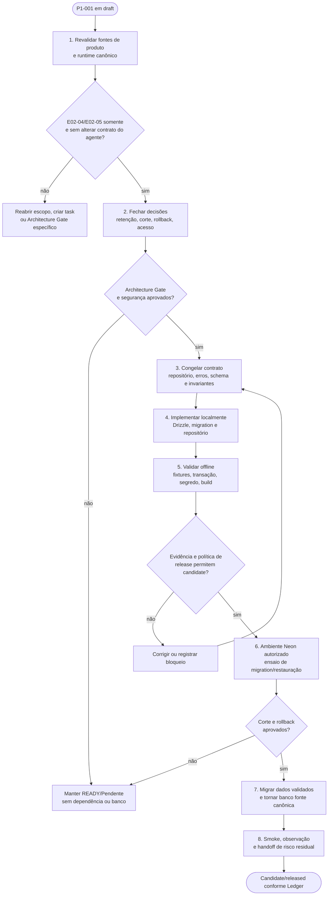

# 🚧 Em execução — Release: fundação de persistência PostgreSQL, Drizzle e Neon

> Prioridade: P1
>
> Área afetada: dados, API, integração externa, segurança e gestão de release
>
> Origem ou referência: substituição gradual de `var/data/llm-responses` e `var/logs/llm-responses`
>
> Arquitetura: `APPROVED — Lucas disse “pode seguir com P1-001” em 2026-09-07; execução limitada ao escopo aprovado e sem provisionar Neon`

## Pedido original preservado

> Fazer com que o BlindSpot use banco de dados PostgreSQL com Drizzle ORM e NeonDB. Arquitetar e criar tabelas, priorizando cibersegurança e criptografia de dados quando aplicável. Arquitetar tabelas de acordo com cada feature.

## Enquadramento como release

Esta task é a arquitetura da **release de fundação de persistência**: uma entrega coesa que torna fichas técnicas validadas recuperáveis e versionadas, sem prometer comparador, exportação, identidade, tenancy, consumo ou observabilidade completa.

| Item | Estado |
|---|---|
| Nome de trabalho | `database-foundation` |
| Estado da release | `draft` — não há migration, dependência, conexão ou versão criada. |
| Fonte/convenção de versão | Pendente: `release-policy.md` ainda não define fonte ou convenção. Não inferir SemVer nem alterar `package.json`. |
| Próximo estado permitido | `candidate`, somente após `APPROVED`, versão declarada, migration revisada e evidências mínimas. |
| `released` | Proibido até aprovação explícita, checklist, handoff, verificações e decisão de risco residual. |
| Publicação, tag ou deploy | Fora do escopo desta task e do Release Ledger. |

Antes de criar o candidate no Release Ledger, esta release deve declarar em `release-policy.md` a fonte e convenção de versão, responsável por aprovação, evidências mínimas e rollback. O ledger registra evidências; não cria tag, versão ou deploy.

### Escopo de features da release

| Feature do catálogo P0 | Papel nesta release | Estado após a release proposta |
|---|---|---|
| E02 — Motor de coleta, qualidade, catálogo e persistência | Persistir somente resposta já validada, veículo, execução, fontes e vínculo por campo. | E02-04 é habilitada; coleta/validação não mudam. |
| E03 — Plataforma web, comparação, exportação e qualidade reportada | Consumirá fichas persistidas no futuro. | Histórico evolui como pré-requisito; comparador, UI nova e exportação continuam planejados. |
| E01 — Autenticação e gestão de acesso corporativo | Define o gate futuro de identidade e autorização. | Sem organizações, usuários, papéis ou cotas antes de Gate próprio. |
| E04 — Gestão de usuários, organizações e consumo | Depende de E01 e não deve ser antecipada pela modelagem de dados desta release. | Sem tenancy, membros ou consumo. |
| E05 — Observabilidade, segurança, incidentes e SLA | Persistir metadados mínimos, hashes e correlação sem logs brutos. | Fundamento técnico; métricas, traces, alertas e SLA continuam planejados. |

P0-002 está concluída. Antes de promover esta release a `candidate`, o [backlog](../../../docs/product/backlog.md) e o [fluxograma de desenvolvimento do agente](../../../docs/product/fluxograma-desenvolvimento-agente.md) devem ser relidos para confirmar que o recorte E02-04/E02-05 e os contratos de runtime não divergiram.

### Rastreabilidade com backlog e fluxograma

Esta release implementa somente o trecho planejado do fluxo: **resposta validada → persistir versão imutável e fontes → ler última ficha/histórico**. Ela não transforma o snapshot local atual em fallback silencioso nem adiciona catálogo de lote, comparação, exportação, conta, tenant ou consumo.

| Referência | Consequência para esta release |
|---|---|
| Backlog E02-04 | A gravação ocorre após AJV e `fonte_ref`; nova coleta cria versão, nunca altera a existente; migração, rollback e restauração são verificáveis. |
| Backlog E02-05 | A identidade exata e a prevenção de duplicata são preparadas pela chave de veículo; slug, lote, merge e importação idempotente ficam fora desta entrega. |
| Fluxograma do agente, seção 7 | A resposta 200 mantém validação anterior à persistência; falha de banco não expõe detalhes e usa correlação por `x-request-id`. |
| Fluxograma do agente, seção 2 | Histórico local atual não equivale a persistência corporativa; após o corte aprovado, não podem coexistir duas fontes de verdade. |
| Fluxograma do agente, seção 7 | Provider, schema, prompt, endpoint e integração Neon só mudam com Architecture Gate e revisão de segurança correspondentes. |

### Fontes de produto, precedência e efeito arquitetural

| Documento ativo | O que esta P1 consome | Regra para a implementação |
|---|---|---|
| `docs/product/README.md` | Persistência versionada é planejada; o histórico local é apenas parcial. | Não promover o banco como capacidade entregue antes de evidência de migration, leitura e corte. |
| `docs/product/backlog.md` | E02-04/E02-05, RF04, RF05 e RF12; gates de qualidade, catálogo, lote, corte e restauração. | Escrever só após validação; versão é append-only; lote é dry-run/idempotente; não coexistem duas fontes de verdade após corte. |
| `docs/product/fluxograma-desenvolvimento-agente.md` | Pipeline atual, erros 400/422/500, correlação, fluxo de persistência/catálogo e decisões pendentes. | A persistência entra depois de `validateResponse`; falha é sanitizada; não alterar prompt/schema/provider por atalho. |
| `docs/product/roadmap.md` | Fase 4 depende de schema, retenção e migração; Fases 5–7 não são antecipadas. | Entregar fundação de dados antes de comparador/exportação; não criar tenancy, consumo ou SLA nesta release. |
| `docs/product/features/README.md` | E02-S01, RF12 e a paridade entre ficha recém-gerada e histórico. | `latest` e `history` retornam a mesma semântica validada, com data, versão, status e fontes preservados. |
| `docs/product/coverage-matrix.md` e `source-inventory.md` | Runtime e evidência local prevalecem sobre fontes históricas; documentação `agent-core` tem drift conhecido. | Código em `services/api/` e assets em `packages/agent-runtime/assets/` vencem textos históricos; toda divergência vira achado, não suposição. |

## Processo arquitetural completo da release

O processo abaixo é obrigatório para chegar de `draft` a uma release verificável. Nenhuma fase implica conexão externa, instalação ou escrita em Neon até que a fase correspondente tenha aprovação explícita.

### Fases, entradas, saída e condição de parada

| Fase | Entrada obrigatória | Saída verificável | Parar se |
|---|---|---|---|
| 1. Revalidar evidências | README, backlog, fluxograma, roadmap, catálogo, matriz, inventário e runtime real. | Matriz de rastreabilidade atualizada; nenhum requisito histórico tratado como runtime. | Contrato, assets ou estados divergem sem decisão registrada. |
| 2. Fechar decisões | Dono, ambiente, retenção, backup, acesso, corte e rollback. | ADR/Gate com escolhas e risco residual aceito. | Falta autoridade para dados, Neon, retenção ou fonte de versão. |
| 3. Congelar contrato | Rotas atuais, tipos, schema e invariantes de E02-04/E02-05. | Interface de repositório, status de falha, modelo de migration e plano de compatibilidade revisados. | A solução exigir mudança de prompt, schema, provider, auth ou tenancy fora do escopo. |
| 4. Implementar localmente | Gate `APPROVED`, dependências revisadas e ambiente seguro. | Código segregado, migration revisável e sem conexão externa automática. | Segredo, driver ou migration exigir acesso não autorizado. |
| 5. Validar offline | Fixtures seguras, banco descartável ou bordas mockadas. | Testes de atomicidade, idempotência, histórico, integridade e sanitização; typecheck/build. | Falha de contrato, versão parcial, fonte ausente ou vazamento de segredo. |
| 6. Ensaiar ambiente autorizado | Candidate, Neon/credenciais autorizados e janela definida. | Migration e restauração descartáveis exercitadas; smoke controlado. | Sem backup, rollback, TLS, menor privilégio ou responsável de ambiente. |
| 7. Corte | Dados elegíveis validados, plano de migração e comunicação. | Banco se torna leitura/gravação canônica; arquivo local deixa de ser fallback silencioso. | Não houver reconciliação, reversão segura ou evidência de integridade. |
| 8. Handoff/release | Verificações, achados, release policy e Ledger completos. | Handoff com limitações, risco residual, dono e próximo passo. | Checklist incompleto ou release declarada sem aprovação explícita. |

## Leituras obrigatórias antes de qualquer implementação

- `AGENTS.md`, especialmente o bloco **Segurança** e o gatilho para `project-security-assurance`.
- `.codex/skills/project-security-assurance/SKILL.md` — revisão proporcional obrigatória para persistência, segredo, integração externa, dependência e API.
- `.codex/project-delivery-kit/optional/project-security-assurance/contract.md` e `SECURITY-REVIEW-TEMPLATE.md` — fronteiras, cenários de abuso, controles, checks, exceções e risco residual.
- `.codex/skills/project-release-management/SKILL.md`, `optional/project-release-management/release-policy.md`, `RELEASES.md` e `RELEASE-CHECKLIST.md` — lifecycle e evidência da release local.
- `docs/product/features/README.md` e `docs/product/roadmap.md` — escopo funcional e dependências da release.

## Decisão e escopo arquitetural

Adotar PostgreSQL hospedado no Neon como persistência transacional de fichas técnicas já validadas. O acesso da API será encapsulado em um pacote/módulo de dados com Drizzle ORM; rotas Express não importam o driver nem montam SQL diretamente. A migration é versionada no repositório e executada somente com ambiente Neon autorizado. A `DATABASE_URL` fica exclusivamente em ambiente local/seguro e jamais em docs, resposta HTTP, logs ou commits.

A primeira versão persiste o resultado validado como `jsonb` imutável, acompanhado dos metadados que sustentam busca, histórico, versionamento e rastreabilidade. Não normalizar cada uma das muitas variáveis da ficha nesta fase: o JSON Schema é extenso, evolui e já é a fonte de validação. Normalizar veículo, execução, ficha e fontes permite consultas estáveis sem duplicar prematuramente centenas de colunas. Uma futura feature de busca analítica por atributos pode criar uma projeção de fatos versionada, após uso e requisitos reais.

### Fluxo da pessoa operadora

1. A pessoa informa o veículo no formulário; a API valida os cinco campos obrigatórios.
2. O runtime compõe o prompt, chama o provider autorizado ou o modo simulated e valida a resposta com AJV e `fonte_ref`.
3. Só após validação, a API cria ou localiza o veículo, abre uma execução e persiste a ficha e suas fontes na mesma transação.
4. A pessoa recebe a mesma resposta atual. A tela de última ficha e histórico passa a ler o repositório PostgreSQL, com ordenação estável e limite validado.
5. Em falha de banco, a API retorna erro genérico com `x-request-id`; não devolve URL, query, stack ou segredo. O comportamento de degradação (falhar a operação versus manter arquivo local) será decidido antes da implementação; a proposta é falhar explicitamente e não criar duas fontes de verdade.

### Contrato da API e ciclo de dados

| Momento | Comportamento proposto | Invariante e evidência |
|---|---|---|
| `POST /api/ficha-tecnica` | Mantém validação de entrada e do resultado do agente; somente depois chama o repositório transacional. | 400/422 continuam antes de qualquer escrita; resposta persistida corresponde ao payload validado. |
| Escrita | Localiza/cria a configuração exata, registra `collection_run`, fontes e uma versão na mesma transação. | Falha em qualquer associação desfaz a escrita inteira; não existe ficha sem fonte/referência válida. |
| `GET /api/ficha-tecnica/latest` | Lê a versão canônica mais recente validada, ou 404 se não houver. | Não mistura arquivo local e banco após o corte. |
| `GET /api/ficha-tecnica/history` | Lê versões ordenadas e limitadas do repositório, revalidando antes de expor. | Ordem estável, limite validado e integridade preservada. |
| Banco indisponível | Mantém `x-request-id`, log sanitizado e erro genérico compatível com o contrato definido. | Não expõe URL, query, stack, segredo ou conteúdo de outro request. O status HTTP definitivo exige decisão registrada antes da implementação. |
| Migração de dados locais | Só considera snapshots que validem contra o schema corrente; logs e dados brutos ficam fora. | Cada migração é auditável, reversível conforme plano e não cria segunda fonte de verdade. |

### Corte, reversão e recuperação

1. **Preparar:** congelar versão de schema, criar inventário de snapshots elegíveis e executar migração em ambiente descartável; não copiar logs brutos, prompts ou respostas inválidas.
2. **Reconciliar:** comparar contagem, hashes, identidade do veículo, fontes e versões entre origem aprovada e banco; divergência bloqueia o corte.
3. **Cortar:** ativar leitura/gravação pelo repositório somente após smoke; o fallback para arquivos não é automático nem invisível.
4. **Reverter:** usar migration revisada e procedimento documentado; se o banco estiver indisponível, falhar explicitamente até uma decisão humana, em vez de alternar fontes.
5. **Recuperar:** exercitar restauração em ambiente autorizado, registrar resultado e alimentar o runbook de E05-02 antes de qualquer compromisso de SLA/piloto.

### Modelo de dados por feature

| Feature | Tabelas propostas | Responsabilidade |
|---|---|---|
| E02 — Veículo, coleta e ficha | `vehicle_configurations`, `collection_runs`, `technical_sheet_versions` | Identidade exata, execução e snapshot validado, sem alterar prompt, schema ou provider. |
| E02 — Fontes e histórico | `sources`, `technical_sheet_sources`, `technical_sheet_versions` | Vínculo por `fonte_ref`, versões imutáveis e consulta de histórico. |
| E03 — Comparação | Nenhuma tabela de comparação nesta release. | As versões salvas serão a entrada futura; comparar não é apenas juntar JSONs. |
| E03 — Exportação e compartilhamento | Nenhuma. | Depende de identidade, autorização e política de exportação. |
| E01 / E04 — Identidade, organizações e consumo | Nenhuma. | Não antecipar tenancy, RBAC, dados de acesso ou cotas antes de Gates próprios. |
| E05 — Segurança, auditoria e operação | Metadados sanitizados em `collection_runs`; migrations Drizzle; `schema_contracts`. | Correlação, integridade e referência ao contrato, sem logs brutos, traces ou alertas completos. |

#### Entidades e invariantes

- `vehicle_configurations`: `id` UUID, `brand`, `model`, `trim`, `model_year`, `market`, `created_at`, `updated_at`; `UNIQUE (brand, model, trim, model_year, market)`. Representa a configuração exata, não um catálogo genérico de marca/modelo. Textos têm forma normalizada para comparação e forma exibível preservada.
- `schema_contracts`: `id` UUID, `label` opcional, `sha256` único, `runtime_asset_path`, `recorded_at`. Registra a referência do schema que validou a ficha; não duplica o conteúdo canônico de `packages/agent-runtime/assets/schema.json` nem guarda prompt.
- `collection_runs`: `id` UUID, `request_id` único, `vehicle_configuration_id` FK, `provider`, `model_name`, `status` (`succeeded`/`failed`), `schema_contract_id` FK, `prompt_sha256`, `started_at`, `finished_at`, `failure_code` sanitizado. Não armazena prompt, turnos, resposta crua, chave ou detalhe interno do provider.
- `technical_sheet_versions`: `id` UUID, `collection_run_id` único, `vehicle_configuration_id` FK, `schema_contract_id` FK, `version_number`, `payload` JSONB, `completeness_summary` JSONB, `payload_sha256`, `created_at`; `UNIQUE (vehicle_configuration_id, version_number)`. Só existe para run bem-sucedida e payload já validado; não é atualizado em lugar, uma nova coleta cria nova versão.
- `sources`: `id` UUID, `canonical_url` única, `title`, `source_type`, `created_at`. URL é dado de proveniência pública; validar esquema HTTP(S), tamanho e canonicalização antes de inserir.
- `technical_sheet_sources`: `technical_sheet_version_id`, `source_id`, `source_ref`; chave única da associação e índice para leitura da versão. `source_ref` corresponde ao identificador no JSON validado.
- Índices: chave de `vehicle_configurations`, `collection_runs.finished_at DESC`, versões por veículo/data, FKs e fontes por versão. Índice JSONB, tabela de fatos, cache e tabelas de comparação somente após consulta real e Architecture Gate específico.

### Backlog específico da release

- DBF-S01 — Como operador, recupero uma ficha salva após reiniciar a API.
    - Task: criar acesso Drizzle, schema e migration inicial.
    - Subtasks: fixar versões de dependência; configurar `DATABASE_URL`; criar client único; documentar execução segura de migrations.
- DBF-S02 — Como operador, consulto última ficha e histórico sem depender de arquivos locais.
    - Task: criar repositório de fichas e substituir os adaptadores de leitura/gravação de `logger.ts`.
    - Subtasks: transação de persistência; ordenação estável; `404` em histórico vazio; preservar contratos HTTP atuais.
- DBF-S03 — Como equipe, consigo verificar a origem e a versão que gerou uma ficha.
    - Task: persistir fontes, hashes e metadados mínimos da execução.
    - Subtasks: extrair fontes do payload validado; calcular hashes sem salvar prompt; teste de rollback quando fonte inválida.
- DBF-S04 — Como mantenedor, mantenho credenciais fora do código e das respostas.
    - Task: definir contrato de ambiente e validação de configuração.
    - Subtasks: atualizar `.env.example` sem valores reais; fail-fast sem `DATABASE_URL`; mascarar detalhes de conexão.
- DBF-S05 — Como responsável pelo produto, limito acesso e retenção de dados.
    - Task: definir política de acesso, backup, retenção e descarte.
    - Subtasks: papel de banco com privilégio mínimo; TLS obrigatório; rotação de segredo; decidir prazo de retenção de logs e fichas.

## Segurança e privacidade — revisão proporcional

Esta revisão foi atualizada seguindo a extensão nova de cibersegurança em `.codex`. Ela é evidência para o Architecture Gate e para a release; não declara o sistema seguro nem substitui revisão humana, pentest autorizado ou aceitação de risco.

### Escopo e gatilhos

- Mudança: nova persistência, dependências, integração Neon, alterações em API e histórico de IA.
- Gatilhos: banco externo, segredo, persistência, endpoint público existente, IA com fontes e dados de observabilidade.
- Dados: dados de veículos e fontes são predominantemente públicos; request IDs, IPs, modelos, metadados operacionais e eventuais dados futuros de conta exigem proteção e minimização.

### Fronteiras, ameaças e controles

- Segredo de conexão: somente `DATABASE_URL` em secret manager/variáveis de ambiente; TLS exigido; usuário de runtime com menor privilégio; usuário de migration separado quando o Neon permitir.
- Exposição HTTP: nenhuma rota administrativa de banco; validação continua antes da persistência; limites de body existentes; erros sem detalhes internos; CORS passa por revisão explícita antes de produção.
- Integridade: AJV e validação de `fonte_ref` precedem escrita; `payload_sha256` e hashes de schema/prompt permitem detectar alteração e reproduzir contexto sem armazenar conteúdo sensível.
- Injeção e concorrência: Drizzle parametrizado, FKs, checks, unicidade e transações; não aceitar nomes de tabela, filtros ou ordenação vindos do cliente.
- Disponibilidade e custo: pool/driver compatível com Neon serverless, timeout limitado, health check sem dados de conexão, índices mínimos e retenção definida.
- Logs: manter logs brutos fora do banco de produção; sanitizar `failure_code`; não copiar `turns`, previews de prompt, respostas não validadas ou stack traces.
- Criptografia: transporte TLS e criptografia em repouso fornecida pelo Neon devem ser confirmados no plano/conta antes do go-live. Criptografia no nível da aplicação não é indicada para o payload público da ficha nesta fase; se dados pessoais ou segredos forem introduzidos, usar envelope encryption com chave gerida externamente, rotação e modelo de acesso aprovados — nunca chave fixa no repositório.
- Release e dependências: antes de instalar Drizzle, driver Neon ou ferramenta auxiliar, registrar versão fixada, origem/licença, permissões, tráfego de dados e reversibilidade no candidate/handoff. Nenhuma ferramenta externa será instalada ou executada nesta etapa arquitetural.

### Verificações planejadas

- Testes unitários do repositório com banco descartável ou mocks de borda: persistir somente payload validado; rollback transacional; unicidade de veículo; associação de fontes; histórico ordenado e limitado.
- Testes de contrato: AJV, `fonte_ref`, status e completude com fixtures seguras antes de provider real.
- Testes de configuração: ausência/má-formação de `DATABASE_URL`; segredo não aparece em erro nem em logs de teste.
- Smoke autorizado: `GET /api/health`, `POST /api/ficha-tecnica` simulated e leitura da última ficha em ambiente Neon autorizado.
- `npm run typecheck`, `npm run build` e revisão da migration gerada antes da aplicação.

### Risco residual, dependências e decisões pendentes

- Necessário: projeto Neon, região, política de backups, acesso de ambiente e responsável pela conta; nada será provisionado automaticamente.
- A API não tem autenticação hoje. Se o banco passar a conter dados de usuário, multi-tenant ou conteúdo privado, autenticação/autorização e `tenant_id` serão um Gate anterior, não uma adaptação posterior.
- Definir retenção, direito de exclusão e migração dos arquivos locais existentes antes do corte. Proposta: não migrar logs brutos; migrar somente snapshots que possam ser validados com o schema atual, em rotina aprovada e auditável.
- Responsável por aceitar risco residual: Lucas.

## Critérios de aceite

- [x] Existe migration Drizzle revisável que cria as tabelas, FKs, unicidade, checks e índices definidos; ela só foi aplicada após autorização explícita ao ambiente Neon informado por Lucas.
- [x] A API mantém os contratos de geração, última ficha e histórico e só grava resposta aprovada pelo validador.
- [x] Uma ficha salva preserva veículo, fontes, resumo de completude, versão/hash do schema e metadados mínimos de execução.
- [ ] `DATABASE_URL` e qualquer segredo permanecem fora de Git, logs, documentos e respostas HTTP.
- [ ] Há testes automatizados de falha transacional, entrada inválida e ausência de configuração; o smoke manual confirmou ausência de vazamento de segredo e `typecheck` passa. O build continua bloqueado por configuração preexistente.
- [ ] A decisão de retenção, backup, acesso e criptografia aplicável está registrada antes do deploy.
- [ ] A release possui versão/fonte declarada, candidate no Release Ledger, checklist, handoff, riscos e procedimento de retirada antes de ser marcada como `released`.
- [ ] Backlog e fluxograma ativos foram conferidos antes do candidate; o recorte permanece limitado a E02-04/E02-05 e às dependências transversais de E05.
- [ ] As oito fases do processo arquitetural possuem evidência ou bloqueio explícito; nenhuma transição de `draft` para `candidate` ocorre por inferência.
- [ ] O corte prova que não há duas fontes de verdade, e a reversão/restauração foi exercitada no nível autorizado antes de qualquer release.

## Restrições e fora do escopo

- Não conectar, provisionar Neon, instalar dependências, executar migration ou alterar código antes de `APPROVED`.
- Não alterar prompt, `schema.json`, provider LLM ou semântica da resposta nesta fase.
- Não criar criptografia caseira nem armazenar material de chave no banco, no `.env.example` ou no repositório.
- Não migrar automaticamente conteúdo de `var/`, sobretudo logs e snapshots brutos.

## Double-check da arquitetura

- Confirmado: a API atual salva snapshots e logs em `var/`, lê a última ficha e o histórico por arquivos e já valida a resposta antes de salvar o snapshot.
- Confirmado: `packages/agent-runtime/assets/schema.json` é a fonte de schema em runtime e deve ter hash/versionamento de referência, não ser duplicado pelo banco.
- Confirmado: ainda não há Drizzle, driver Postgres/Neon ou autenticação no `package.json` e no fluxo observado.
- Estados de ausência/erro previstos: banco indisponível, configuração ausente, migration incompatível, fonte inválida, payload inválido, histórico vazio e falha transacional.
- A proposta evita dupla fonte de verdade: o arquivo local deixa de ser fallback silencioso após o corte, mas a decisão final depende da estratégia de migração aprovada.
- Confirmado: as features E01–E05 existem no backlog atual; esta release inclui a fundação de dados de E02 e metadados transversais de E05. E01, E03 e E04 são deliberadamente excluídas para não criar identidade, exportação ou tenancy sem autorização própria.
- Confirmado: a extensão de segurança, contrato e template estão instalados em `.codex`; serão relidos antes da implementação e suas evidências entram no handoff/release.
- Confirmado: o Release Ledger existe, mas `release-policy.md` está com campos não configurados. Logo, há planejamento de release, não candidate ou versão declarada.
- Confirmado: `docs/product/README.md`, backlog, fluxograma, roadmap, catálogo, matriz e inventário foram relidos nesta reestruturação. O catálogo usa numeração histórica de épicos distinta do backlog; esta P1 usa E02-04/E02-05 do backlog para escopo e cita o catálogo apenas como rastreabilidade de E02-S01/RF12.
- Confirmado: a arquitetura separa decisões que precisam de autoridade (Neon, retenção, backup, acesso, corte, rollback e status HTTP de indisponibilidade) de decisões de implementação que só começam após `APPROVED`.

## Resultado do agente

- Estado: `🚧 Em execução`
- Arquitetura: `APPROVED — Lucas disse “pode seguir com P1-001” em 2026-09-07; execução limitada ao escopo aprovado e sem provisionar Neon`.
- Implementação: fundação e integração concluídas neste recorte: dependências, schema Drizzle, configuração, migration SQL revisável, modo explícito, repositório transacional e adaptação das rotas foram adicionados. Testes automatizados de borda, candidate e decisões de release permanecem pendentes.
- Arquivos alterados: este arquivo (reaberto e reestruturado).
- Verificação: perfil, estratégia, catálogo P0, roadmap, inventário de fontes, PDK de segurança, AGENTS, contrato/template de segurança e contratos/política/ledger/checklist de release relidos.
- Verificações bloqueadas: Neon/credenciais/ambiente externo, versão/política de release e decisão de retenção não foram disponibilizados — nenhuma conexão foi tentada. P0-002 está concluída; backlog e fluxograma devem ser rechecados antes do candidate.
- Manutenção de coerência (2026-09-07): referências de épicos foram alinhadas ao backlog vigente e a task passou a referenciar explicitamente backlog e fluxograma. Isso não altera estado, arquitetura, escopo de implementação ou autorização da release.
- Manutenção arquitetural (2026-09-07): a task passou a consumir explicitamente todos os documentos ativos de `docs/product` e a descrever o processo completo de evidência, gate, contrato, implementação local, validação offline, candidate, ensaio autorizado, corte, reversão, recuperação e handoff. O estado permanece pendente; nenhuma integração ou dependência foi acionada.
- Início autorizado (2026-09-07): Lucas aprovou a P1-001. A execução começa pela inspeção do runtime e pela base local; nenhuma conta Neon será provisionada, nenhuma credencial será solicitada/exposta e nenhuma migration será aplicada fora de ambiente explicitamente autorizado.
- Fundação local (2026-09-07): npm foi configurado para usar a store de certificados do Windows mantendo `strict-ssl`; Drizzle ORM e driver Neon foram instalados. A registry reportou vulnerabilidades transitivas; `npm audit fix` não foi executado automaticamente. A migration não foi aplicada e `PERSISTENCE_MODE=file` permanece o padrão até integração e corte aprovados.
- Verificação parcial (2026-09-07): `npm run typecheck` passou após a fundação local. `npm run build` permanece bloqueado por configuração preexistente: `vite.config.ts` não existe e o Vite tenta ler um diretório sem permissão. Não foi alterado neste recorte. A integração transacional nas rotas e os testes de repositório seguem como próximas etapas desta task.
- Decisão de driver (2026-09-07): a inspeção dos tipos do Drizzle confirmou que `neon-http` não suporta transação interativa. A fundação foi corrigida para `drizzle-orm/neon-serverless` com `Pool`, preservando transação atômica para a futura gravação de ficha/fontes/versão. Nenhuma conexão é criada enquanto `PERSISTENCE_MODE=file` estiver ativo.
- Migration e smoke autorizados (2026-09-07): após Lucas configurar `DATABASE_URL` e autorizar a operação, `npm run db:migrate` aplicou com sucesso a migration gerada no Neon. Consulta sem dados de negócio confirmou as seis tabelas. O smoke transacional persistiu uma ficha do fixture canônico, suas fontes e metadados, e confirmou leitura de última ficha e histórico. A URL, senha e respostas de negócio não foram exibidas. A CA do Windows foi habilitada de forma persistente para novos processos Node; processos já abertos precisam ser reiniciados para herdá-la.
- Segurança de erro (2026-09-07): respostas HTTP 500 deixaram de devolver a mensagem interna; o detalhe público agora é `null` e a observabilidade fica no log do servidor.
- Bloqueio conhecido (2026-09-07): o smoke completo da rota com `LLM_PROVIDER=simulated` ainda não pôde iniciar porque o runtime procura `prompt-assets/mock-response.json`, enquanto o fixture existe em `packages/agent-runtime/assets/mock-response.json`. Isso é preexistente e pertence ao recorte de runtime/prompt, deliberadamente fora desta P1.
- Próximo passo: adicionar testes automatizados de repositório/erro, definir política e versão de release, retenção, backup, acesso e estratégia de migração antes de candidate. A P1 permanece em execução até essas evidências.
