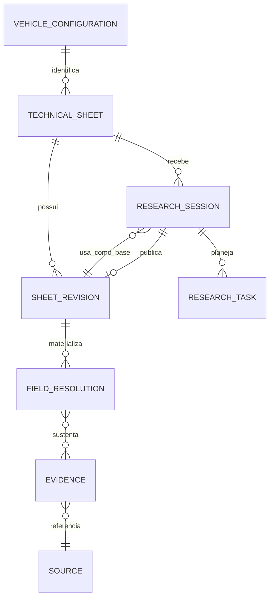

# ✅ Concluída — Fechar arquitetura do domínio de pesquisa técnica continuada

> Prioridade: P1
>
> Área afetada: arquitetura, domínio, dados, API, IA e documentação
>
> Origem ou referência: proposta `Arquitetura Completa do Sistema de Pesquisa e Fichas Técnicas do BlindSpot (1).md`, analisada em 2026-09-11
>
> Arquitetura: `APPROVED — Lucas disse “pode seguir” em 2026-09-11; escopo limitado à arquitetura desta task.`
>
> Triagem automática: `Material — define contratos futuros de dados, IA, API e interface.`
>
> Segurança: `Aplicável — persistência, API e pesquisa com IA exigem revisão proporcional.`

## Pedido

Produzir e aprovar a arquitetura canônica para transformar a geração pontual em pesquisa contínua, compatível com os assets de runtime e a persistência já existente. A decisão deve separar `Vehicle` (identidade da configuração), `Technical Sheet` (linha de trabalho independente), `Revision` (snapshot imutável) e `Research Session` (tentativa orientada por foco).

## Critérios de aceite

- [x] Um glossário e diagrama de relações distinguem inequivocamente Vehicle, Sheet, Revision, Session, Evidence e Source.
- [x] A decisão preserva `vehicle_configurations`, versões e fontes existentes por uma migração compatível, sem reescrever histórico.
- [x] Continuação, nova ficha, refresh, reprocessamento e fork têm semânticas, permissões e efeitos de linhagem explícitos.
- [x] A arquitetura define fronteira para evidência compartilhada sem permitir que uma ficha altere silenciosamente outra.
- [x] A revisão de segurança registra confiança, dados de pesquisa, idempotência, concorrência, retenção e risco residual.

## Restrições ou contexto

- Ler `AGENTS.md`, perfil PDK, estratégia de verificação, `packages/agent-runtime/assets/`, `services/api/db/schema.ts`, `repository.ts`, P1-001 a P1-004 e a proposta de origem.
- Documentação não substitui runtime; não alterar prompt, schema, banco, endpoint ou provider nesta task de arquitetura.
- Decisões esperadas: monólito modular; `vehicle_configurations` evolui como identidade de configuração; Sheet é nova entidade; Revision é append-only; Session é auditável e pode produzir uma ou mais revisions.

## Architecture Gate — proposta canônica (2026-09-11)

### Fatos confirmados

- O runtime canônico continua em `packages/agent-runtime/assets/`; o fluxo atual gera uma resposta completa, valida AJV, `fonte_ref`, identidade e políticas antes de persistir.
- A persistência atual já possui `vehicle_configurations`, aliases, `collection_runs`, `technical_sheet_versions`, `sources` e `technical_sheet_sources`. Contudo, uma versão pertence diretamente à configuração; ainda não existe uma linha de trabalho independente para várias fichas do mesmo veículo.
- P1-002 normaliza identidade exata e fontes; P1-003 preserva normalização/proveniência; P1-004A mantém conflito sem vencedor automático. P1-011 e P1-013 já fornecem sessão autenticada, RBAC e auditoria.
- O histórico atual deve permanecer legível. Documentos de arquitetura orientam, mas não substituem assets, schema e validações de runtime.

### Decisão e escopo

Adotar um **monólito modular**, não microsserviços, no qual a unidade de identidade é a `VehicleConfiguration` e a unidade de trabalho é a `TechnicalSheet`.

O recorte V1 cria somente as fronteiras e os invariantes que permitem evolução: ficha independente, revisões append-only, sessão estruturada, plano pesquisável e evidência por campo. Não cria Knowledge Base global, reputação algorítmica, merge, autopilot, microserviço, fila distribuída ou ranking opaco.

### Glossário e invariantes

| Conceito | Responsabilidade | Invariante |
| --- | --- | --- |
| `VehicleConfiguration` | Identidade normalizada de marca/modelo/versão/ano-modelo/mercado. | Uma chave exata não é unida por similaridade sem confirmação; aliases ajudam descoberta, não alteram identidade. |
| `TechnicalSheet` | Linha de trabalho independente sobre uma configuração. | Pertence a uma configuração e organização; não é sobrescrita por coleta posterior. |
| `SheetRevision` | Snapshot validado e imutável de uma ficha. | É sequencial por ficha, referencia runtime/schema e nunca é atualizado in place. |
| `ResearchSession` | Tentativa com objetivo, base e orçamento próprios. | Não muda outra ficha; só publica revisão após validação integral. |
| `ResearchPlan/Task` | Decomposição interna de uma sessão. | Alvos são resolvidos no servidor a partir da revisão-base e políticas vigentes. |
| `Evidence` | Afirmação observada que pode sustentar um campo. | Mantém fonte, aderência e instante; não é promoção automática a fato. |
| `FieldResolution` | Decisão em uma revisão para um caminho de variável. | Explica valor/status/evidências ou preserva ausência/conflito; não elimina evidência alternativa. |
| `Source` | Recurso canônico de proveniência. | Política e aderência continuam server-owned; URL é dado de proveniência, não autoridade por si. |

### Semântica do ciclo de vida

| Ação | Efeito permitido | Não é |
| --- | --- | --- |
| Continuar | Cria sessão na mesma ficha, usando uma revisão-base. | Nova ficha ou sobrescrita. |
| Nova ficha | Cria nova linha de trabalho para a mesma configuração. | Nova configuração de veículo. |
| Criar a partir de base | Cria ficha nova com linhagem de revisão copiada por referência. | Alteração da origem. |
| Refresh | Sessão na mesma ficha para atualizar/validar dados por atualidade. | Reprocessamento de runtime. |
| Reprocessar | Sessão com versão de modelo/política/runtime explicitamente comparável. | Refresh implícito. |
| Fork | Nova ficha com `parent_sheet_id`, `origin_revision_id`, razão, ator e instante. | Merge ou cópia mutável. |
| Merge | Futuro, assistido por humano e baseado em evidências. | Operação V1 ou automática. |

`latest` é a revisão/ficha mais recente segundo tempo; `recommended` é sugestão calculada por política explicável; `primary` é escolha autorizada no escopo de organização. Nenhum dos três substitui os outros.

### Fluxo V1

1. A pessoa seleciona uma configuração exata ou confirma uma ambiguidade; o resolver usa chave normalizada/aliases e não faz união probabilística silenciosa.
2. Ela continua uma ficha ou cria outra. A API autoriza pela organização/papel antes de revelar ou alterar qualquer recurso.
3. A sessão registra revisão-base, preset de foco, alvos efetivos, preferências permitidas de fonte, orçamento, versão de runtime e idempotency key.
4. O planejador resolve `MISSING_VARIABLES`, `CONFLICT_RESOLUTION`, `LOW_CONFIDENCE`, `OFFICIAL_SOURCES`, categorias ou variáveis em dados estruturados. Instrução livre apenas complementa o objetivo e jamais relaxa schema, política, domínio ou orçamento.
5. O orquestrador V1 executa uma sessão por ficha como padrão. Resultado passa pelas validações atuais; campos sem prova ficam `nao_encontrado`, `nao_aplicavel`, `conflitante` ou estado futuro `research_exhausted`, nunca preenchidos por completude.
6. A publicação abre uma revisão nova em transação. Se a revisão-base estiver obsoleta, a sessão fica `needs_rebase`/`conflicted` e não sobrescreve edição ou revisão concorrente.

### Modelo de dados e compatibilidade

P1-030 deve adicionar, em migration revisável, `technical_sheets` e `sheet_revisions` como sucessores semânticos, mantendo leitura dos identificadores já publicados. Cada registro atual de `technical_sheet_versions` será mapeado deterministicamente para uma ficha de migração e sua revisão correspondente, preservando payload, hash, `schema_contract`, `collection_run`, fontes, data e contexto organizacional.

P1-031 a P1-033 podem então introduzir `research_sessions`, `research_tasks`, `field_resolutions` e `evidence`. A evidência compartilhável é **somente leitura por referência**: ficha consumidora escolhe sua própria resolução/revisão; nenhum cache ou conhecimento de veículo pode alterar outra ficha. A Knowledge Base só será avaliada em P2-002 após métricas de repetição, isolamento e retenção.

### API, concorrência e confiabilidade

- A futura criação de sessão deve ser idempotente por organização/ficha/chave e usar o ator exclusivamente da sessão autenticada.
- A futura rota conceitual `POST /technical-sheets/{sheetId}/research-sessions` recebe foco estruturado; o servidor calcula variáveis-alvo e retorna estado sanitizado. Corpo HTTP não fornece ator, tenant, escopo de fonte privilegiada ou versão vencedora.
- Revisões usam número monotônico por ficha e controle otimista sobre `base_revision_id`. A transação rejeita publicação que não possa ser reconciliada; não há last-write-wins.
- Estados de sessão propostos: `queued`, `running`, `succeeded`, `partial`, `failed`, `cancelled`, `needs_rebase`; transições são allowlisted e auditadas.
- A V1 não tenta paralelismo de escrita na mesma ficha. Sessões simultâneas requerem desenho posterior de composição e checkpoint de contrato.

### Qualidade, recomendação e parada

A avaliação V1 é um vetor, não uma nota mágica: `completeness`, `evidence`, `consistency`, `freshness` e `human_validation`. Um agregado só pode ser exibido como resumo secundário, versionado e explicável. Ele não confirma campos, promove fonte, resolve conflitos ou altera `primary`.

A recomendação de próxima ação será não mandatória e baseada em lacunas observáveis: faltas relevantes sugerem `MISSING_VARIABLES`; conflitos, `CONFLICT_RESOLUTION`; boa completude com evidência fraca, `OFFICIAL_SOURCES` ou `VALIDATE_EXISTING`. A sessão para por orçamento, tempo, tentativas, ausência de candidatos elegíveis, cancelamento, cobertura/qualidade-alvo ou necessidade de revisão humana — nunca apenas por tentar alcançar 100%.

### Segurança — revisão proporcional

- **Gatilhos:** nova persistência, endpoints autenticados, IA com busca/ferramentas, instrução livre, orçamento/custo, evidência de terceiros, auditoria e concorrência.
- **Fronteiras:** pessoa autenticada → API/RBAC → foco/planejador → provider e conteúdo externo não confiável → validação/políticas → banco/auditoria → interface autorizada.
- **Riscos principais:** prompt injection via instrução/evidência; IDOR entre organizações; custo ou ciclos ilimitados; publicação concorrente; evidência não aderente parecer confirmação; vazamento de URL, texto, prompt, segredo ou dado de cliente.
- **Controles propostos:** foco allowlisted e alvos resolvidos no servidor; instrução livre limitada e tratada como dado não confiável; RBAC/tenant no servidor; idempotência, base revision e transação; AJV, `fonte_ref`, política/aderência server-owned; orçamentos e condições de parada; eventos sanitizados e sem conteúdo bruto; revisão humana append-only para decisões de qualidade.
- **Verificações futuras:** fixtures para estados/linhagem/idempotência e concorrência; testes de isolamento por organização/RBAC; AJV, evidência, fonte e qualidade em modo simulated; `typecheck`, `build`, smoke autenticado. Provider real e dados externos continuam bloqueados sem ambiente e autorização.
- **Risco residual:** fontes públicas podem mudar e pesquisas podem permanecer incompletas; o produto deve mostrar incerteza, nunca convertê-la em confirmação.

### Conformidade proporcional

Aplicável porque sessão, auditoria e instrução livre podem tratar dados de pessoas. A finalidade proposta é pesquisa técnica automotiva autorizada; `organization` é o controlador responsável por definir base legal, transparência, retenção/descarte e destinatários antes de P1-031 enviar ou persistir instrução livre. A arquitetura limita o dado ao objetivo técnico, proíbe inclusão deliberada de dados sensíveis/crianças e proíbe colocar texto livre em telemetria.

A referência é a LGPD, especialmente os princípios de finalidade, necessidade, transparência, segurança e prestação de contas ([Lei 13.709 consolidada — Planalto, consultada em 2026-09-11](https://www.planalto.gov.br/ccivil_03/_ato2015-2018/2018/lei/l13709compilado.htm)). Não é parecer jurídico: a base legal e a política de retenção são pendências humanas que **bloqueiam** P1-031 se instruções livres ou dados pessoais forem enviados a provider/terceiro. Para P1-029 não houve coleta, envio nem persistência de dado pessoal.

### Plano incremental

1. Aprovar esta decisão e registrar eventuais ajustes de semântica.
2. P1-030: migration compatível para ficha/revisão/linhagem, com rollback e teste do histórico atual.
3. P1-031/P1-032: sessão e orquestrador modular, inicialmente sequenciais, com modo simulated e orçamento explícito.
4. P1-033/P1-034: evidência por campo, vetores de qualidade e recomendação explicável.
5. P1-035/P1-036: workspace de veículo e jornada de foco/progresso, reutilizando RBAC e contratos comprovados.
6. Só após métricas e nova arquitetura: reputação, cache/Knowledge Base, fork e autopilot.

### Decisões pendentes para aprovação humana

1. Confirmar `TechnicalSheet` como agregado de trabalho e `VehicleConfiguration` como identidade, sem uma entidade genérica de veículo nesta fase.
2. Aceitar a migração compatível que preserva versões existentes, em vez de substituir a tabela atual destrutivamente.
3. Confirmar o padrão V1 de uma sessão ativa por ficha e controle otimista por revisão-base.
4. Aceitar que `recommended` é não mandatória e vetorial; `primary` requer ação autorizada.
5. Confirmar que instrução livre não será enviada/persistida até finalidade, retenção, transparência, destino e validação do responsável estarem definidos.

### Double-check da arquitetura

- A proposta não confunde a configuração exata atual com ficha independente; ela preserva a identidade e evita duplicação sem bloquear linhas de trabalho legítimas.
- O desenho não promete a capacidade inexistente de evidência por campo, revisões por ficha ou sessões: elas foram separadas em P1-030 a P1-033.
- `conflitante` permanece sem vencedor automático, compatível com `quality-policy.json`; ausência continua um resultado válido.
- Autenticação/RBAC já existem, mas não autorizam por si o tratamento de instrução livre ou a transferência a provider; a pendência de conformidade é explícita.
- Não há dependência de microserviço, worker distribuído, cache global, modelo novo, provider novo, rede, migration ou alteração de runtime nesta task.
- Conclusão: arquitetura `READY`, mas a implementação permanece bloqueada até `APPROVED` para as cinco decisões acima.

## Dependências

- Estado e compatibilidade reais de P1-001, P1-002, P1-003 e P1-004A revalidados.

## Resultado do agente

_Preenchido pelo agente. Não apague o pedido original._

- Estado: `✅ Concluída`
- Arquitetura: `APPROVED — Lucas disse “pode seguir” em 2026-09-11.`
- Triagem automática: `Material — Architecture Gate obrigatório antes de qualquer contrato.`
- Segurança: `Aplicável — revisão proporcional registrada; controles futuros dependem de gate por task.`
- Implementação: arquitetura canônica, semântica de ciclo de vida, limites de V1, plano incremental, revisão de segurança e conformidade proporcional registrados nesta própria task. Não houve alteração de runtime, schema, banco, endpoint, provider ou integração externa.
- Arquivos alterados: `.codex/task-queue/entrada/P1-029-fechar-arquitetura-do-dominio-de-pesquisa-continuada.md`.
- Verificação: releitura de `packages/agent-runtime/assets/`, `services/api/db/schema.ts`, `repository.ts`, `index.ts`, P1-001 a P1-004, P1-011, P1-013 e documentação operacional; `git diff --check` passou para o artefato. A referência oficial da LGPD foi consultada em 2026-09-11; não houve tratamento, transmissão ou persistência de dado pessoal nesta task.
- Limitações: P1-030 deve revalidar o estado de P1-001 antes da migration; P1-031 fica bloqueada para instrução livre enquanto finalidade, base legal, retenção, transparência e destino do dado não forem definidos pelo responsável.
- Próximo passo: ativar P1-030 quando solicitado e produzir seu Architecture Gate específico antes de qualquer migration ou alteração de contrato.
