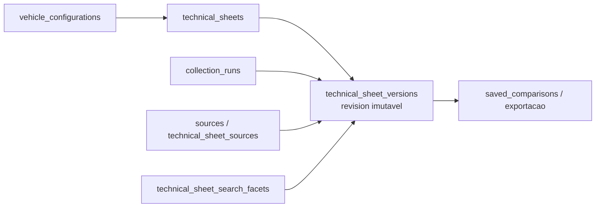

# ✅ Concluída — Evoluir persistência para fichas, revisões e linhagem

> Prioridade: P1
>
> Área afetada: dados, API, migração e auditoria
>
> Origem ou referência: P1-029; proposta de pesquisa contínua
>
> Arquitetura: `APPROVED — Lucas autorizou “seguir com o que está pendente para destravar” em 2026-09-11; checkpoint P1-001 registrado abaixo.`
>
> Triagem automática: `Material — altera persistência e contratos de leitura.`
>
> Segurança: `Aplicável — dados persistidos, migração, auditoria e API.`

## Pedido

Evoluir a fundação PostgreSQL para que uma mesma configuração de veículo possa possuir várias fichas independentes, cada uma com revisões imutáveis e linhagem opcional. Migrar as versões atuais sem perda de payload, hash, fonte, acesso ou histórico.

## Critérios de aceite

- [x] Uma `technical_sheet` pertence a uma configuração de veículo e pode coexistir com outras fichas da mesma configuração.
- [x] Cada resultado publicado é uma `revision` imutável, ordenada por ficha e vinculada ao snapshot/execução que a originou.
- [x] A migração converte o histórico atual de forma determinística, reversível e auditável.
- [x] `latest`, `recommended` e `primary` não são sinônimos e têm escopo/precedência explícitos.
- [x] Escritas usam idempotência, transação e optimistic locking ou equivalência aprovada; colisões não sobrescrevem dados.

## Restrições ou contexto

- Depende de P1-029 `APPROVED` e da conclusão/compatibilidade de P1-001.
- Não criar Knowledge Base, ranking, fork de UI ou merge nesta entrega.
- Preservar `fonte_ref`, hashes, `schema_contract`, organização/ator e respostas sanitizadas; nunca copiar prompt ou snapshot bruto para novas tabelas.

## Preflight — P1-030 (2026-09-11)

### Pedido e recorte

- **Resultado esperado:** separar a linha de trabalho `TechnicalSheet` da revisão imutável hoje materializada por `technical_sheet_versions`, sem perder uma versão, fonte, hash, vínculo de execução ou contrato público existente.
- **Paths e contratos consultados:** `services/api/db/schema.ts`, `repository.ts`, `client.ts`, migrations `drizzle/0000` a `0016`, `services/api/index.ts`, `authentication.ts`, `audit.ts`, P1-001, P1-029, perfil e estratégia de verificação.
- **Fatos confirmados:** P1-001 já criou schema/migrations e repositório transacional, mas continua `🚧 Em execução` por evidências de release/testes pendentes. `technical_sheet_versions` é append-only e hoje é único por `collection_run`, porém sua numeração é por `vehicle_configuration`, não por ficha. `collection_runs` já carrega organização/conta/membro quando a geração é autenticada. Fontes e facetas referenciam a versão por ID, o que permite preservá-las sem regravação.
- **Lacuna crítica:** os handlers de última ficha/histórico exigem autenticação, mas `readLatestTechnicalSheet` e `readTechnicalSheetHistory` não recebem contexto organizacional nem filtram por tenant. Essa lacuna não pode ser carregada para a nova linhagem.

### Impacto, risco e reversibilidade

- **Afetados:** persistência PostgreSQL, repositório, leituras de ficha/catálogo/exportação, auditoria, histórico e futuras sessões. Runtime, schema JSON, prompt, provider e interface de workspace ficam fora deste corte.
- **Riscos:** migração parcial; atribuição errada de legado a organização; IDOR por leitura sem tenant; número de revisão duplicado sob concorrência; quebra de IDs usados por fontes/facetas/comparações/exportação; exposição de payload, URL, prompt ou segredo em erro/migração.
- **Reversibilidade:** migration é expand/backfill/validate/cutover, sem renomear ou apagar a tabela atual neste corte. Abortar antes do cutover mantém as colunas/tabelas novas sem serem usadas; rollback de aplicação volta às consultas antigas. Qualquer divergência de contagem, hash, origem, fonte ou organização interrompe a promoção e exige decisão humana.

### Verificação prevista

- Fixtures/migration descartável: contagens, hashes, fontes, facetas, comparações e exportação permanecem referenciando o mesmo `technical_sheet_versions.id`.
- Testes de transação, idempotência, unicidade de revisão e conflito de base; testes de tenant para última, histórico, catálogo, exportação e leitura exata.
- `npm run typecheck`, `npm run build`, contratos de catálogo/evidência e smoke authenticated + simulated; nenhuma conexão Neon, provider real ou migração de ambiente sem autorização específica.

### Próximo passo do preflight

`Architecture Gate — recorte suficiente, mas a implementação fica inelegível sem checkpoint de compatibilidade da P1-001 e aprovação explícita.`

## Architecture Gate — ficha, revisão e linhagem (2026-09-11)

### Decisão proposta

Evoluir incrementalmente o modelo físico existente, sem renomear nem reconstruir `technical_sheet_versions`. A nova entidade `technical_sheets` passa a representar a linha de trabalho; `technical_sheet_versions` permanece a tabela física e o identificador público de cada revisão, recebendo `technical_sheet_id` como vínculo obrigatório após backfill.

Isso preserva os IDs já consumidos por fontes, facetas, comparações e exportação. `technical_sheet_versions` é a representação física de `SheetRevision` até que uma migração futura, justificada e compatível, prove benefício de renomeação; nenhuma renomeação é necessária para o produto.

### Tabelas e invariantes propostos

| Artefato | Proposta | Invariantes |
| --- | --- | --- |
| `technical_sheets` | `id`, `vehicle_configuration_id`, `organization_id`, `created_by_member_id`, `state`, `parent_sheet_id`, `origin_revision_id`, `created_at`, `updated_at`. | Nova ficha é única por UUID, pertence a uma organização e uma configuração; linhagem é opcional e não permite ciclo ou cross-tenant. |
| `technical_sheet_versions` | Adicionar `technical_sheet_id`; manter `id`, payload, hashes, fontes e `collection_run_id`. | Cada versão pertence a exatamente uma ficha depois do backfill; nunca atualiza payload/fonte/hashes in place. |
| Numeração | Manter `version_number` histórico e adicionar/interpretar uma sequência monotônica por `technical_sheet_id` validada em transação. | Chave única por ficha e revisão; não usar `MAX()+1` sem lock/controle de concorrência. |
| `collection_runs` | Adicionar `technical_sheet_id` para novas gravações e backfill quando dedutível. | Request continua único; a ficha é derivada de ator/organização no servidor, não do corpo HTTP. |
| Preferências | Não persistir `recommended` nesta P1. `latest` é derivado temporal; `primary` será uma preferência organizacional autorizada em task posterior. | Nunca usar “mais recente” como “melhor” nem produzir fallback silencioso. |

Para dados novos, `organization_id` é obrigatório e igual ao contexto autenticado. Linhagem/fork não é exposta aqui: os campos apenas preservam uma extensão futura e permanecem nulos até P2-003. Dados legados sem `collection_runs.organization_id` não recebem organização inventada; entram em ficha `legacy_unassigned`, sem leitura por rotas organizacionais, até decisão/backfill administrativo explícito. Isso evita vazamento entre tenants.

### Migração e corte propostos

1. **Expandir:** criar `technical_sheets`; adicionar FKs/índices novos inicialmente permissivos; não alterar payload nem apagar índice/constraint existente.
2. **Backfill determinístico:** para cada grupo `(vehicle_configuration_id, collection_run.organization_id)`, criar uma ficha `legacy_imported`; ligar cada versão e run ao novo ID. O grupo sem organização fica isolado como `legacy_unassigned` e não é elegível à leitura normal.
3. **Reconciliar:** comparar por versão IDs, `payload_sha256`, `schema_contract_id`, `collection_run_id`, fontes, facetas e timestamps. Contagem ou hash divergente bloqueia a migração.
4. **Endurecer:** somente após reconciliação, tornar vínculo de versão obrigatório e criar unicidade de revisão por ficha. Remover a antiga unicidade por configuração somente quando consultas/escritas não dependam mais dela e com migration reversível aprovada.
5. **Cortar escrita:** `persistTechnicalSheet` primeiro resolve/cria uma `technical_sheet` no tenant do ator e, na mesma transação, cria run, versão, fontes/facetas e auditoria. Não há dual-write entre banco e arquivo.
6. **Cortar leitura:** todas as funções de ficha passam a receber `AuthContext` e filtram por organização antes de selecionar versão, catálogo, exportação ou histórico. IDs inexistentes e recursos de outro tenant retornam o mesmo resultado não enumerável definido pelo contrato.

### Contratos e comportamento preservado

- Esta task não cria endpoints públicos de `TechnicalSheet`; P1-035 fará a jornada/rotas novas depois de validar o modelo.
- Os endpoints existentes preservam formato de resposta enquanto passam a selecionar a revisão equivalente no tenant do solicitante. O ID de versão continua válido para exportação e comparação, sempre com autorização server-side.
- `latest` continua estritamente temporal no escopo autorizado; `recommended` é indisponível nesta fase; `primary` é indisponível até regra de preferência, papel e auditoria próprios.
- O repositório não deve expor função de leitura sem `AuthContext` para recursos organizacionais. O modo `file` continua fora do corte de dados relacionais e não pode ser fallback silencioso para PostgreSQL.

### Concorrência, idempotência e auditoria

- Toda escrita da ficha ocorre na transação existente; a linha da ficha é bloqueada/atualizada de forma a reservar a próxima revisão sem colisão.
- Uma `idempotency_key` de criação de ficha/sessão futura deve ter escopo de organização e intenção. Nesta P1, a unicidade existente de `collection_runs.request_id` permanece como proteção da geração.
- Uma alteração futura usa `base_revision_id`; nesta P1, nenhum update de revisão é permitido. Conflito de gravação falha controladamente e gera evento auditável, sem last-write-wins.
- Novas ações de auditoria são allowlisted e registram apenas ator, recurso, resultado e `request_id`; não incluem payload, URL, prompt, token ou dados de configuração.

### Revisão de segurança proporcional

- **Escopo e gatilhos:** schema/migration, persistência de dados, APIs autenticadas, autorização tenant, auditoria e integrações de banco.
- **Fronteiras e falha principal:** ator autenticado → API → repositório → PostgreSQL. A falha principal é uma versão de organização A ser retornada ou associada à ficha de B durante backfill/leitura; concorrência pode criar duas revisões com a mesma sequência.
- **Controles:** `organization_id` derivado da sessão; consultas tenant-scoped; legado sem tenant isolado; FKs e checks de pertencimento; transação, unicidade, controle otimista/reserva de sequência; backfill por grupos determinísticos; reconciliação por hash; erros sanitizados e auditoria allowlisted.
- **Verificações:** testes de IDOR para cada leitura; migration em base descartável com reversão; fixtures de legado sem tenant e de duas organizações; concorrência/idempotência; typecheck/build e smoke simulated. Teste Neon, backup/restauração e corte real continuam bloqueados sem ambiente/autoridade.
- **Risco residual:** legado sem dono exige operação administrativa posterior; ele não será “adivinhado” nem exibido enquanto não houver decisão verificável. Lucas é o responsável por aceitar o risco residual após evidências.

### Revisão de conformidade proporcional

Aplicável: conta, membro e organização são dados pessoais/corporativos e a migração vincula fichas ao seu escopo. Finalidade: impedir acesso indevido e manter rastreabilidade de fichas técnicas autorizadas. O controlador e a base legal concreta precisam ser confirmados pelo responsável; esta arquitetura não decide base legal.

Minimização: reutilizar apenas IDs internos já necessários; não copiar nome/e-mail para as novas tabelas, não registrar prompt/texto bruto e não enviar dados a novo terceiro. Retenção/descarte dos dados `legacy_unassigned`, transparência para titulares e procedimento de reassociação administrativa devem ser definidos antes de corte de ambiente. A revisão segue a LGPD, incluindo finalidade, necessidade, transparência e segurança ([Lei 13.709 consolidada — Planalto, consultada em 2026-09-11](https://www.planalto.gov.br/ccivil_03/_ato2015-2018/2018/lei/l13709compilado.htm)).

### Plano incremental e condição de bloqueio

1. Fechar checkpoint P1-001: schema/migrations atuais, testes de repositório e política de rollback são a base imutável da P1-030.
2. Implementar migration expand/backfill e testes descartáveis, sem conexão Neon ou alteração de runtime.
3. Adaptar schema/repositório para criação/leitura tenant-scoped, preservando formatos HTTP existentes.
4. Executar reconciliação, testes de segurança/concorrência e verificações padrão; só então avaliar cutover local autorizado.
5. Abrir P1-031 apenas quando todas as leituras/escritas de revisão respeitarem ficha e organização.

**Bloquear a implementação** se P1-001 alterar os contratos de persistência enquanto esta task estiver ativa; se uma versão legada não puder ser reconciliada; se `organization_id` não puder ser determinado ou isolado; se houver consulta de recurso organizacional sem filtro de tenant; ou se faltar owner para retenção/recuperação de legado.

### Double-check da arquitetura

- O plano preserva `technical_sheet_versions.id`, portanto não quebra FKs atuais de fontes, facetas, comparações ou exportações.
- A criação de uma ficha não é derivada de similaridade de veículo; usa a configuração exata já normalizada.
- Um único snapshot histórico pode virar `legacy_imported`, mas a arquitetura documenta essa limitação e não afirma que as antigas coletas foram fichas independentes.
- `latest`, `recommended` e `primary` não são confundidos nem introduzidos com comportamento automático ainda não comprovado.
- O escopo não inclui prompt, schema JSON, provider, rede, worker, UI, Knowledge Base, fork operável ou merge.
- Conclusão: arquitetura `READY` para implementação somente após `APPROVED` e o checkpoint da P1-001; sem essas duas condições, P1-030 continua pendente.

### Checkpoint de compatibilidade P1-001 (2026-09-11)

- `services/api/db/schema.ts`, `services/api/db/repository.ts` e `drizzle/` estão sem alterações concorrentes no worktree; a última migration registrada é `0016_remove_curated_research_documents`.
- `technical_sheet_versions.id` é a chave referenciada por fontes, facetas, comparações e exportação; a P1-030 preservará esse ID e só adicionará relações compatíveis.
- Há alteração paralela em `services/api/index.ts`, limitada à telemetria sanitizada logo após a validação da geração. A P1-030 é owner apenas do recorte de persistência e de leituras de ficha; não altera a telemetria nem seus contratos.
- P1-001 segue `🚧 Em execução` por evidências de candidate/release, retenção, backup e recuperação. Esses itens continuam na release de fundação e não são confundidos com a compatibilidade local necessária para P1-030; qualquer mudança posterior de schema/repository reabre este checkpoint.
- Resultado: checkpoint aprovado para a implementação local isolada da P1-030. Migration de ambiente, backup/restauração e candidate continuam dependentes de autorização/ambiente próprios.

## Resultado do agente

- Estado: `✅ Concluída em 2026-09-12 — remanescente reconciliado pela P0-014.`
- Arquitetura: `APPROVED — autorização e checkpoint P1-001 registrados em 2026-09-11.`
- Triagem automática: `Material — migration e contrato de leitura.`
- Segurança: `Aplicável — revisão proporcional registrada; migration real exige evidência de tenant, backup/rollback e ambiente autorizado.`
- Implementação: `technical_sheets` representa a linha de trabalho; runs e versões recebem vínculo compatível sem alterar IDs, payloads, hashes, fontes ou facetas. A migration `0017` fez o backfill determinístico por configuração+organização e isolou legado sem organização. As migrations `0018`/`0019` evoluíram a regra de concorrência: há no máximo uma ficha padrão por organização+configuração, mas fichas independentes ativas podem coexistir. O repositório resolve/cria somente a ficha padrão do ator na transação e grava o vínculo em run/versão. Última ficha, histórico e exportação recebem `AuthContext` e filtram `collection_runs.organization_id`; o catálogo global aprovado não foi alterado.
- Arquivos alterados: `services/api/db/schema.ts`, `services/api/db/repository.ts`, `services/api/index.ts` (somente leituras de ficha; telemetria paralela preservada), `drizzle/0017_technical_sheets_lineage.sql`, `drizzle/0018_technical_sheets_active_scope.sql`, `drizzle/0019_technical_sheets_default_scope.sql`, `drizzle/meta/_journal.json`, verificadores de linhagem/isolamento/concorrência em `scripts/`, `package.json` e esta task.
- Verificação: `npm run verify:technical-sheet-lineage`, `npm run typecheck` e `git diff --check` passaram. As verificações dinâmicas autorizadas no PostgreSQL configurado passaram com `TENANT_ISOLATION=PASS` e `SHEET_CONCURRENCY=PASS`; a última usa duas transações reais para a ficha padrão, prova a colisão sem sobrescrita e cria uma ficha ativa não padrão para provar coexistência. `npm run db:migrate` aplicou `0017`, `0018` e `0019` sem ler/expor payload, fonte, URL ou segredo. A reconciliação anterior confirmou `0` versões sem vínculo, `0` runs sem vínculo e `1` ficha `legacy_unassigned`. `npm run build` continua bloqueado por ausência de `vite.config.ts` no checkout, independente desta alteração.
- Pendências: P1-035 implementará rotas e jornada explícitas por ficha; P2-003 tratará fork/linhagem operável. Backup/restauração, retenção e candidate de release permanecem no escopo de P1-001.
- Próximo passo: P1-031, sem reabrir contratos de persistência concluídos nesta task.

## Reconciliação P0-012 — 2026-09-12

O corte de migração, ficha independente e locking otimista foi entregue, mas a auditoria estática confirmou que `versionNumber` ainda é calculado por `vehicle_configuration_id` em `persistTechnicalSheetInTransaction`, não por `technical_sheet_id` como exigia o critério de revisão sequencial por ficha. Esta reabertura preserva a evidência do corte entregue e limita o remanescente à correção de numeração/índices, compatibilidade e testes de concorrência. A implementação material será consolidada pela `P0-014`, com Architecture Gate próprio; nenhuma migration é autorizada por esta nota.

## Fechamento P0-014 — 2026-09-12

A P0-014 entregou a correção remanescente: a unicidade e a sequência de `technical_sheet_versions` agora são por `technical_sheet_id`, e a publicação bloqueia a ficha com `FOR UPDATE` antes da validação da revisão-base. As verificações dinâmicas no PostgreSQL configurado passaram com isolamento de tenant, concorrência de ficha e duas sessões concorrentes (`TENANT_ISOLATION=PASS`, `SHEET_CONCURRENCY=PASS`, `RESEARCH_EXECUTION=PASS`). Esta task volta a `✅ Concluída`; não houve alteração de frontend nesta reconciliação.
