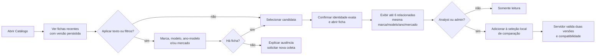
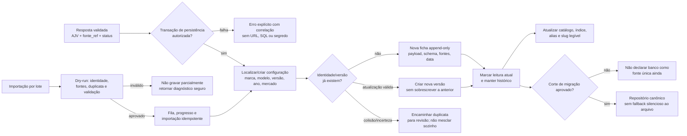
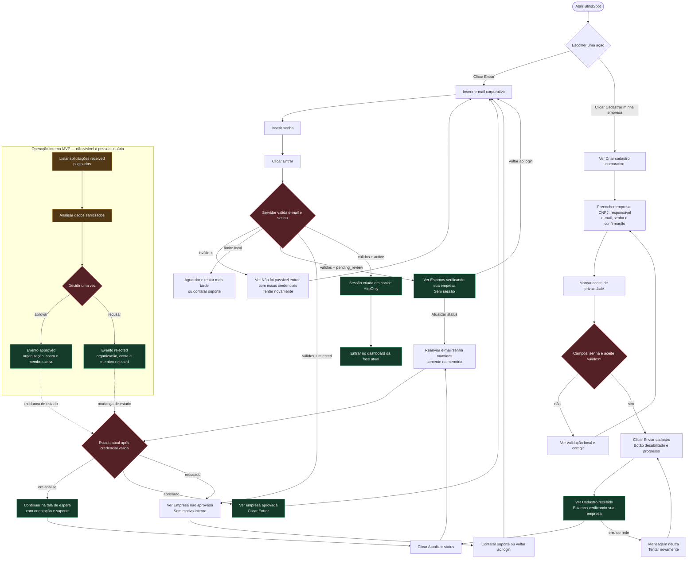
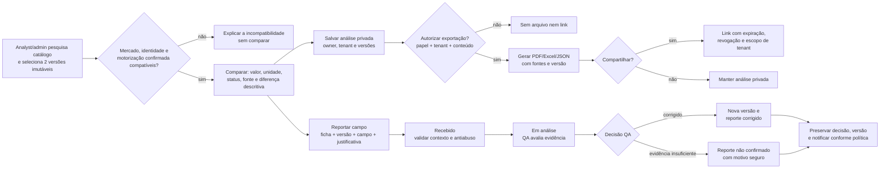
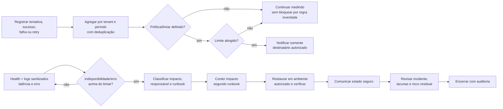
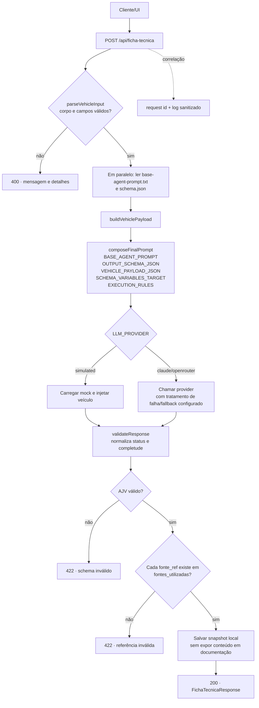
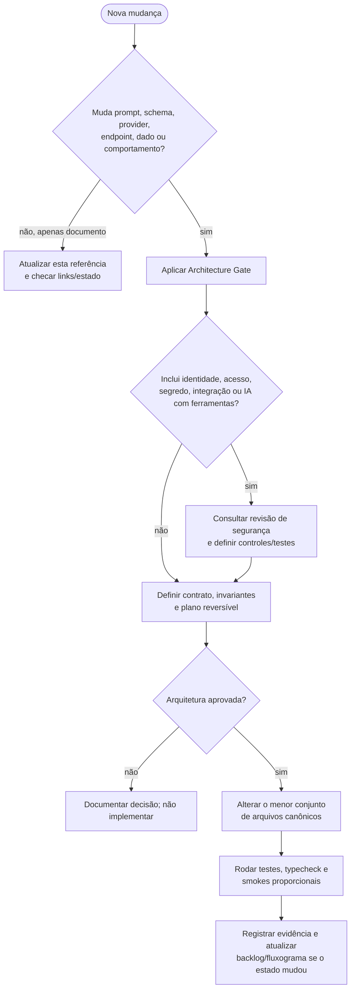

# Fluxograma visual do BlindSpot e guia para desenvolvimento do agente

> **Referência principal de fluxo.** Este documento consolidou o fluxograma anteriormente mantido em HTML em um Markdown navegável e acrescenta o fluxo técnico que uma pessoa desenvolvedora deve seguir ao evoluir o agente. É a única referência de fluxograma ativa em `docs/product`.

## Como ler

| Marca | Significado |
|---|---|
| 🟢 Implementado | Há evidência no checkout atual. |
| 🟠 Parcial | Há parte do caminho, mas não prontidão corporativa completa. |
| 🔵 Planejado | Está no backlog; não existe como capacidade comprovada. |
| 🟣 Proposta / a decidir | Precisa de decisão antes de implementação. |
| 🔴 Gate | Segurança, qualidade ou autorização; a falha deve bloquear o avanço. |

**Precedência:** comportamento atual vem de `services/api/`, `packages/agent-runtime/assets/`, `apps/web/` e evidências locais. O [backlog](backlog.md) descreve intenção; os documentos em [arquitetura](../architecture/agent-core/) podem ter nomenclatura histórica e não substituem o runtime.

## 1. Mapa consolidado da jornada

```mermaid
flowchart LR
  semConta([Sem conta]) --> pedir[Solicitar acesso corporativo\nE01-01 · RF09]
  pedir --> empresa{Empresa aprovada?\nP1-009}
  empresa -- não --> recusa[Recusa segura\nsem sessão]
  empresa -- sim --> pendente[Organização pending_activation\nsem membro, senha ou sessão]
  pendente --> convite[Operador emite/revoga convite\nP1-010 · token HMAC · 72h]
  convite --> ativar{Token único válido,\nnão revogado e não usado?}
  ativar -- não --> recuperar[Resposta neutra; operador\npode reemitir sem expor empresa]
  ativar -- sim --> credencial[Nome + senha 12–128\nscrypt + salt + pepper]
  credencial --> ativacao[Transação: consumir token,\ncriar admin, ativar organização]
  ativacao --> identidade[Login P1-011: e-mail + senha\nconta, membro e organização ativos]
  identidade --> sessao[Sessão opaca HMAC\ncookie HttpOnly; logout revoga]
  sessao --> acesso{P1-013 valida no servidor\nsessão + tenant + papel + recurso}
  acesso -- negado --> bloqueio[Ação bloqueada\nfalha fechada]
  acesso -- autorizado --> consultar[Consultar ficha\nidentidade exata · RF01]

  consultar --> qualidade[Gerar/localizar, normalizar\ne validar schema + fonte_ref\nRF02–RF06]
  qualidade --> utilizavel{Ficha utilizável?}
  utilizavel -- inválida/ausente --> coleta[Solicitar ou reprocessar coleta\nsem sucesso falso]
  coleta --> qualidade
  utilizavel -- conflito/baixa confiança --> qa[QA revisa evidência\nreprocessa ou não confirma]
  qa --> qualidade
  utilizavel -- sim --> leitura[Ver campos, status,\nfontes, versão e completude\nRF04/RF06/RF12]

  leitura --> acao{Próxima ação}
  acao -- comparar --> compat{Fichas compatíveis?\nRF07}
  compat -- não --> semComparacao[Explicar incompatibilidade\nsem vencedor automático]
  compat -- sim --> comparativo[Comparar e salvar\nversões preservadas]
  acao -- exportar/compartilhar --> exportar{Papel, tenant e\nconteúdo autorizados?}
  exportar -- não --> semExportacao[Não gerar arquivo/link]
  exportar -- sim --> artefato[Exportar ou compartilhar\nfontes + versão + auditoria\nRF08]
  acao -- reportar --> reporte[Reportar ficha, versão e campo]
  reporte --> resolver[QA resolve: corrigido,\ndevolvido ou não confirmado]

  acesso --> admin{Administrador?}
  admin -- sim --> membros[Gerir membros\nlistar equipe e gerar link único]
  membros --> conviteMembro[Convite HMAC · 72h\nlink exibido uma única vez]
  conviteMembro --> ativarMembro[Convidado define nome e senha\nconta/membro ficam ativos]
  membros --> papelMembro[Alterar papel de outro membro\nproteger último admin]
  membros --> desativarMembro[Desativar outro membro\ne revogar suas sessões]
  admin -- sim --> consumo[Admin consulta consumo mensal\n1 por ficha persistida]
  coleta --> eventoUso[Evento imutável por collection run\nsucesso 1 · falha 0]
  eventoUso --> consumo
  consumo --> limite{Política mensal ativa\ne limiar atingido?}
  limite -- sim --> alerta[Alerta interno único\nadmins ativos do tenant]
  alerta --> reconhecer[Admin reconhece alerta\ntrilha preservada]
  limite -- não --> sair([Logout])
  membros --> sair
  comparativo --> sair
  artefato --> sair
  resolver --> sair
  leitura --> sair

  health[Health, logs sanitizados,\nlatência e correlação · RF13] -. indisponibilidade .-> incidente[Classificar incidente e\ncomunicar estado seguro]
  incidente -. impacto .-> recuperar

  classDef atual fill:#153b2b,stroke:#40c986,color:#fff;
  classDef parcial fill:#523814,stroke:#e7a43c,color:#fff;
  classDef futuro fill:#1b315e,stroke:#6f93ff,color:#fff;
  classDef decidir fill:#432859,stroke:#b780e3,color:#fff;
  classDef gate fill:#542126,stroke:#ff626b,color:#fff;
  class qualidade,consultar,health parcial;
  class pendente,convite,ativar,credencial,ativacao,coleta,qa,comparativo,artefato,reporte,resolver,membros,consumo,alerta,incidente futuro;
  class pedir,empresa,identidade,utilizavel,acao,admin,limite decidir;
  class acesso,compat,exportar gate;
```

As setas tracejadas indicam operação e indisponibilidade. A autorização é sempre uma decisão de servidor; controles da interface nunca bastam para liberar um recurso.

## 2. Consulta de ficha: detalhe que orienta o agente

```mermaid
flowchart LR
  v[1. Informar veículo\nmarca, modelo, versão, ano-modelo, mercado] --> entrada[2. Validar entrada\ntrim; ano inteiro 1900–2100]
  entrada -- erro 400 --> corrigir[Corrigir dados e reenviar]
  entrada --> localizar[3. Localizar ficha/histórico\nidentidade, versão e mercado]
  localizar --> existe{4. Há versão válida,\nrastreável e permitida?}
  existe -- sim --> abrir[5. Abrir ficha\nvalor, unidade, status, fonte e completude]
  existe -- não --> fila[5a. Solicitar coleta\nfila/progresso explícitos]
  fila --> fontes[5b. Coletar fontes\norigem, data e identidade exata]
  fontes --> governar[5c. Conferir identidade exata\ne política de fontes]
  governar --> normalizar[5d. Normalizar\nvalores/unidades sem perder origem]
  normalizar --> validar[5e. Validar saída\nschema, fonte_ref, ausência e conflito]
  validar --> estado{Confirmada e utilizável?}
  estado -- sim --> abrir
  estado -- conflito/ausência --> revisao[Expor estado ou encaminhar QA\nNunca confirmar artificialmente]
  revisao --> fila
  abrir --> proxima[6. Comparar, exportar, reportar ou sair]
```

O endpoint atual aceita corpo plano ou `{ "vehicle": { ... } }`. Campos obrigatórios: `marca`, `modelo`, `versao`, `ano_modelo` e `mercado`. Na experiência planejada, a busca mostra estados de **carregando**, **encontrado**, **não cadastrado**, **incompatível** ou **erro**; nunca devolve uma configuração aproximada em silêncio. O histórico local não deve ser confundido com persistência corporativa/versionada em banco, que ainda é planejada.

### Descoberta no catálogo (P1-024 implementado)

Recentes e relacionadas não usam histórico de navegação, perfil, IA, telemetria, ranking ou inferência de motorização. A relação apenas facilita descoberta e não garante compatibilidade; ao comparar, o servidor ainda valida mercado, identidade e motorização.

## 3. Persistência, catálogo e versões (planejado)

Este fluxo implementa a intenção de E02-04/E02-05. Banco, retenção, migration, backup, formato de slug e política de merge continuam decisões de task e Architecture Gate próprios.

## 4. Cadastro, espera, aprovação e login — visão da pessoa usuária (P0-008 implementado)

O cadastro cria em uma transação a solicitação `received`, organização `pending_review`, conta/membro inicial `pending` e credencial com `scrypt`, salt e pepper. A aprovação/recusa atualiza as quatro entidades na mesma transação. Não há consulta pública por protocolo, CNPJ ou e-mail: a atualização depende de credenciais válidas e não persiste senha em URL, `localStorage` ou logs. Veja a coleção de operação em `../operations/api-collections/`; ela usa variáveis locais e não contém chave real. Convites P1-010 continuam somente para organizações legadas `pending_activation`.

## 5. Conta, convite legado, sessão e autorização

```mermaid
flowchart LR
  conta[Solicitar conta\nempresa, contato, e-mail corporativo] --> pedido{Entrada válida e\nempresa não duplicada?}
  pedido -- não --> respostaSegura[Protocolo/erro seguro\nsem enumeração]
  pedido -- sim --> aprovar{Operação aprova empresa?}
  aprovar -- não --> recusar[Recusar sem liberar acesso]
  aprovar -- sim --> pendente[Organização pending_activation\nsem conta, membro ou sessão]
  pendente --> token[Operador emite/revoga\nconvite inicial por rota interna]
  token --> hash[Token aleatório 32 bytes\nHMAC no banco; URL/token só uma vez]
  hash --> ativar{Convite válido,\nem 72h, não revogado/usado?}
  ativar -- não --> novoConvite[Resposta neutra; reemissão\nrevoga anterior sem expor empresa]
  ativar -- sim --> senha[Definir nome e senha 12–128\nscrypt + salt + pepper]
  senha --> transacao[Transação: token used,\nadmin active, organização active]
  transacao --> semLogin[Ativação não cria sessão\nlogin P1-011 é etapa separada]
  semLogin --> entradaLogin{Login por senha\nou SSO aprovado?}
  entradaLogin -- senha --> credencial{Credencial, conta, membro e\norganização ativos?}
  entradaLogin -- SSO --> idp{Callback, issuer, audience\ne claims válidos?}
  credencial -- não --> limiteLogin[Resposta neutra\n5 tentativas/15 min locais]
  limiteLogin --> recuperar[Recuperação futura\nP1-012]
  recuperar --> revogar[Trocar credencial e\nrevogar sessões anteriores]
  idp -- não/indisponível --> erroSSO[Falha fechada\nsem criar tenant]
  credencial -- sim --> sessaoLogin[Sessão opaca, 12h,\ncookie HttpOnly]
  sessaoLogin --> mfa{MFA exigido\npela organização?}
  idp -- sim --> mfa
  mfa -- sim --> desafio[Matrícula/desafio/recuperação MFA]
  desafio -- incompleto --> semSessao[Sem sessão]
  desafio -- concluído --> autorizar
  mfa -- não --> autorizar{Servidor confere sessão,\ntenant, papel e recurso próprio}
  autorizar -- não --> negar[Negar por padrão e auditar]
  autorizar -- sim --> executar[Consultar, gerir, exportar\nou comparar]
  executar --> auditoria[Evento sanitizado]
  membros[Admin altera papel\nou desativa membro] --> revogaMembro[Revogar sessão imediatamente\npreservar trilha aprovada]
  revogaMembro --> negar
  auditoria --> logout[Logout revoga sessão]
```

**Implementado no P1-009/P1-010/P1-011/P1-013/P1-014/P1-015/P1-016:** solicitação com protocolo sem enumeração, aprovação para `pending_activation`, emissão/revogação interna do convite, ativação atômica do primeiro `admin`, identidade global mínima, login por senha, sessão opaca e logout persistente. P1-013 valida sessão, organização, papel e recurso no servidor: catálogo automotivo é global para toda sessão corporativa ativa; geração e importações exigem `analyst` ou `admin`; execuções de importação ficam privadas por organização; e ações sensíveis deixam evento sanitizado de auditoria. P1-014 adiciona a tela Equipe para administradores: convite de membro por link único de 72h, ativação sem sessão, alteração de papel, revogação de convite e desativação com revogação de sessões. P1-015 adiciona a visão mensal privada de consumo: cada ficha persistida soma uma unidade, falhas somam zero e a mesma execução não é duplicada. P1-016 permite política mensal sem default e alerta interno único, visível/reconhecível somente por admins ativos do tenant. Tokens de convite e de sessão só existem em transporte/cookie e como HMAC no banco; caminhos de convite são mascarados nos logs. O produto ainda não envia e-mail automático, não cobra e não bloqueia uso. MFA, SSO e recuperação continuam em tasks próprias (P1-012 e sucessoras), sob Architecture Gate e revisão de segurança.

### Contratos do convite implementados

| Ação | Rota e fronteira | Resultado e estados | Dados que não podem vazar |
|---|---|---|---|
| Emitir primeiro administrador | `POST /api/organizacoes/solicitacoes/:protocol/convites/admin-inicial`; exige `x-operator-approval-key` | `201` retorna `invitationId`, token **uma única vez**, expiração e `issued`; só para organização `pending_activation`; reemissão revoga convite `issued` anterior | Chave, token em banco e token em logs/auditoria |
| Revogar | `POST /api/organizacoes/convites/:id/revogar`; exige a mesma chave temporária | `200 revoked`; somente convite ainda `issued` pode mudar | Token, e-mail ou dados da empresa na resposta de falha |
| Ativar | `POST /api/convites/:token/ativar`; recebe `display_name` e senha | `200 activated`; senha válida cria membro `admin`, credencial e organização `active` em uma transação | Token inválido/revogado/expirado/reutilizado recebe `404` neutro; senha e derivação nunca são logadas |

O token tem o formato de transporte `INV-…`, 32 bytes aleatórios codificados em base64url; somente seu HMAC é armazenado. A senha tem 12–128 caracteres e é derivada por `scrypt` com salt aleatório e `PASSWORD_PEPPER`, sem sessão criada. A expiração foi verificada pela regra de 72 horas e pela guarda de estado; o smoke local persistido no Neon cobriu emissão (`201`), revogação (`200`), ativação revogada (`404`), senha fraca (`400`), ativação válida (`200`) e replay (`404`).

## 5. Análise, exportação, compartilhamento e reporte (planejado)

**Implementado no P1-017:** a comparação recebe exatamente dois UUIDs de versões, é calculada no servidor por `comparison-contract-v1` e usa par canônico para não duplicar o mesmo par invertido. Mercado diferente, motorização ausente/divergente ou identidade de versão inconsistente bloqueiam o fluxo com código explicável. A análise salva referencia as versões imutáveis e só pode ser lida por `analyst`/`admin` da mesma organização; não há exportação, link, edição ou compartilhamento. Uma comparação não escolhe vencedora para valores ausentes ou conflitantes. Um reporte não altera a ficha por si só: ele cria uma pendência de revisão com evidência e versão identificáveis.

## 6. Consumo, alertas, saúde e incidentes

Políticas de cota, destinatários, SLI/SLO/SLA, severidade e canais de comunicação são decisões pendentes. Logs e comunicação não podem expor segredo, prompt, resposta bruta de LLM, host interno ou dado de outro tenant.

## 7. Fluxo canônico do agente no runtime atual

Rotas hoje presentes incluem `GET /api/health`, `POST /api/ficha-tecnica`, `GET /api/ficha-tecnica/latest`, `GET /api/ficha-tecnica/history`, solicitação/aprovação de organização e as três rotas de convite descritas acima. Todas devem conservar o contrato de erro de `HttpError`: `{ message, details }`; exceções não mapeadas retornam `500` com mensagem genérica.

### Mapa de implementação — onde mudar, o que preservar

| Necessidade | Ponto atual | Invariante que não pode quebrar | Verificação mínima |
|---|---|---|---|
| Entrada de veículo/contrato HTTP | `services/api/index.ts` e `types.ts` | identidade exata; corpo inválido dá 400 | testes de corpo plano/aninhado, vazios e limites de ano |
| Prompt e schema | `packages/agent-runtime/assets/base-agent-prompt.txt`, `schema.json` | schema, instrução e payload são explicitamente compostos | fixture válida e inválida; inspeção do prompt sem registrar conteúdo sensível |
| Composição | `services/api/prompt-builder.ts` | cinco seções e variáveis obrigatórias continuam presentes | teste unitário de composição e caminhos |
| Roteamento de LLM | `services/api/llm.ts` | provider não pode burlar validação; fallback só quando configurado | mock, erro do provider e resposta cercada por Markdown |
| Normalização/validação | `services/api/validator.ts` | ausência/conflito não viram confirmado; `fonte_ref` sempre aponta para fonte declarada | AJV, status e referências inexistentes retornam 422 |
| Histórico/snapshots locais | `services/api/logger.ts` e rotas de histórico | não publicar segredos, logs ou snapshot bruto | respostas `latest/history` validadas; revisão de conteúdo gravado |
| UI | `apps/web/` | UI mostra estado/fonte, mas não é camada de autorização | fluxo de sucesso, 400, 422, 500 e vazio |

### Desvio técnico que deve ser resolvido por task, não silenciosamente

`prompt-builder.ts` lê os assets canônicos em `packages/agent-runtime/assets/`, porém `llm.ts` ainda declara `PROMPT_ASSETS_DIR` como `prompt-assets` para o mock. Isso é uma **inconsistência observada no checkout**, não uma decisão deste fluxograma. Antes de modificar provider, mock, prompt ou schema: abrir uma task com Architecture Gate, decidir o caminho canônico e provar o comportamento em teste. Não copiar assets ou criar duplicação implícita apenas para ocultar o problema.

## 8. Decisão antes de mexer no agente

## 9. Matriz de rastreabilidade para desenvolvimento

| Requisito | Fluxo/resultado que a implementação deve preservar |
|---|---|
| RF01 | Consulta identifica marca, modelo, versão, ano-modelo e mercado sem mistura. |
| RF02 | Geração/coleta retorna estrutura rastreável, não texto solto. |
| RF03 | A resposta é validada no schema antes de responder. |
| RF04–RF05 | Fontes são exibidas e cada `fonte_ref` aponta para uma fonte declarada. |
| RF06 | Confirmado, parcial, inferido, não encontrado, não aplicável e conflito permanecem legíveis. |
| RF07 | Comparação futura exige compatibilidade explícita e preserva versões. |
| RF08 | Exportação/compartilhamento futuro exige autorização servidor/tenant e trilha auditável. |
| RF09 | Conta, sessão, papel e organização são gates; negar por padrão. |
| RF10–RF11 | Consumo é agregado por organização; alertas não vazam informação. |
| RF12 | Ficha/histórico futuro preserva identidade, versão e proveniência. |
| RF13 | Health, logs sanitizados, correlação e incidente são estados operacionais distintos. |

## 10. Melhorias de fluxo pendentes de decisão

| Lacuna agora explicitada | Onde acompanhar | Condição para implementação |
|---|---|---|
| Banco canônico, migração, backup e retenção | E02-04 e P1-001 | Architecture Gate de dados, revisão de segurança, ambiente autorizado e plano de corte sem duas fontes de verdade. |
| Lote, aliases, slug e merge revisável | E02-05 | Contrato de identidade, idempotência, política de colisão e testes de lote parcial. |
| Recuperação, MFA, SSO e revogação | E01-03 a E01-06 | Decisão de identidade, modelo de tenancy, threat model e revisão de integração. |
| Estados do reporte e notificações | E03-04 | Fila de QA, política antiabuso, retenção e regras de notificação. |
| Contenção, restauração e pós-incidente | E05-02 | Runbook, responsável, ambiente descartável, SLI/SLO e decisão de backup/RPO/RTO. |

## Checklist de handoff

- [ ] Declarei se o nó alterado é implementado, parcial, planejado ou a decidir?
- [ ] Mantive `schema.json` e `base-agent-prompt.txt` como ativos controlados, sem dados secretos?
- [ ] Testei sucesso, entrada inválida (400), schema/fonte inválida (422) e falha inesperada (500)?
- [ ] Confirmei que status de ausência/conflito não foi convertido em confirmação?
- [ ] Se a mudança toca autenticação, tenant, provider, persistência, exportação ou integrações, há Architecture Gate e revisão de segurança aprovados?
- [ ] Atualizei este guia, backlog e evidências somente quando o runtime realmente comprovou a mudança?

## Referências e manutenção

- [Backlog detalhado](backlog.md), [roadmap](roadmap.md), [matriz de cobertura](coverage-matrix.md) e [catálogo](features/README.md) explicam a intenção de produto.
- [Pipeline HTTP](../architecture/agent-core/HTTP_PIPELINE.md), [composição de prompt](../architecture/agent-core/PROMPT_COMPOSITION.md) e [validação/tipos](../architecture/agent-core/VALIDATION_AND_TYPES.md) explicam contratos; conferir sempre contra o código quando houver divergência.
- Os fluxogramas HTML e Markdown anteriores foram removidos após esta consolidação. Atualize este documento quando fluxo, contrato ou estado comprovado mudar.
