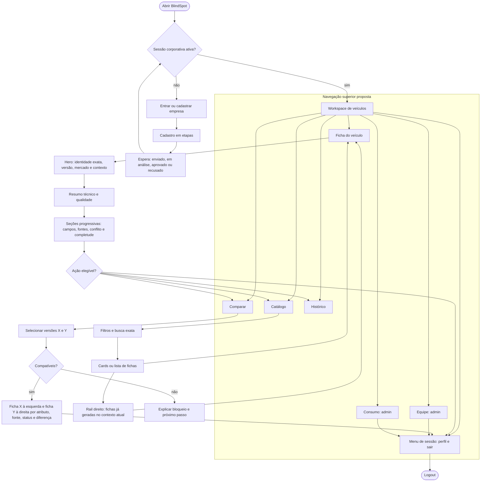
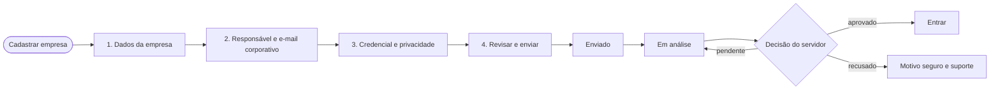

# Fluxo de refatoração da experiência — BlindSpot

> Estado: `PROPOSTA_DE_ARQUITETURA_DE_EXPERIENCIA`. Complementa, mas não substitui, o [fluxograma funcional canônico](fluxograma-desenvolvimento-agente.md). Ele descreve a organização desejada das jornadas e deve orientar tasks de UI; não afirma que uma capacidade planejada já exista no runtime.
>
> A auditoria completa, as decisões e o backlog desta refatoração estão em [Auditoria UX/UI do estado atual](ux-ui-auditoria-estado-atual.md), [Direção UX/UI alvo e decisões](ux-ui-direcao-alvo-e-decisoes.md) e [Roadmap UX/UI de refatoração](ux-ui-roadmap-e-backlog.md).

## Premissas preservadas

- Identidade exata de veículo: marca, modelo, versão, ano-modelo e mercado não podem ser aproximados silenciosamente.
- Proveniência, completude, status, conflito, versão e elegibilidade permanecem informações decisórias.
- Servidor continua sendo a fonte de autorização por sessão, tenant e papel.
- Comparação e exportação só aparecem quando as versões e permissões são elegíveis.

## Architecture Gate

**Decisão:** criar documentação de direção visual, governança e jornada-alvo; não alterar runtime, schema, prompt, API, sessão, persistência, dependência, assets de produção ou comportamento de produto nesta fatia.

**Segurança e conformidade:** não aplicáveis nesta mudança documental. As evidências devem continuar sem credenciais, token, cookie, logs brutos ou dados pessoais desnecessários. Uma task de implementação que toque autenticação, dados, endpoint, exportação, persistência ou integração deverá abrir sua revisão proporcional.

**Aprovação:** `APPROVED — Lucas autorizou a consolidação e a evolução padrão do PEK em 2026-09-11.`

## Mapa de navegação alvo

## Cadastro e aprovação robustos

Cada etapa informa o que já foi preenchido, o que falta e como voltar com segurança. A timeline de espera representa somente estados confirmados pelo servidor; não cria previsão de prazo fictícia, notificação inexistente ou acesso antes da aprovação.

## Orientação: decisão pendente

O fluxo `Orientação` não entra na navegação-alvo como página autônoma. Antes de removê-lo, inventariar o conteúdo e redistribuir apenas o que for necessário como ajuda contextual em cadastro, catálogo, ficha, comparação ou estados vazios. A remoção efetiva exige task, evidência e Architecture Gate de UI.

## Relação com a implementação

| Fase | Dependência funcional | Estado |
|---|---|---|
| Navegação superior e workspace | tarefa de UI e Design System | Proposta |
| Hero e leitura progressiva de ficha | contratos atuais de ficha e qualidade | Proposta sem alterar schema |
| Cadastro multi-etapas e timeline | fluxo de cadastro ou aprovação existente; não alterar servidor sem gate | Proposta |
| Catálogo com rail de geradas | P1-024/P1-025 e decisão sobre escopo de fichas exibidas | Proposta |
| Comparação X/Y | P1-017 e elegibilidade servidor | Proposta |
| Remoção de Orientação | inventário de conteúdo e task específica | A decidir |

## Manutenção para agentes

Ao alterar uma jornada, atualizar este documento, o Design System e a task correspondente. Ao alterar contrato, API, sessão, qualidade, comparação ou persistência, atualizar também o fluxograma funcional canônico após confirmação no runtime. Nunca converter uma proposta deste documento em capacidade implementada apenas por existir no desenho.
