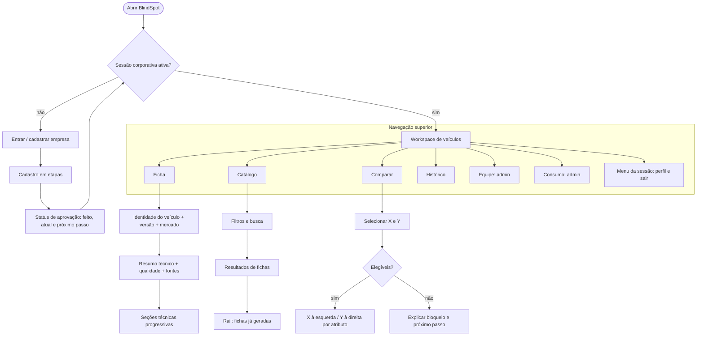

# Direção UX/UI alvo e decisões — BlindSpot

> Estado: `ARQUITETURA_DE_EXPERIENCIA_APROVADA` em 2026-09-11 para planejamento documental. Cada alteração de runtime continua exigindo Architecture Gate na task correspondente.

## Decisão, escopo e limites

**Decisão:** transformar a experiência de uma coleção de telas centradas em formulário/tabela para um produto centrado na ficha técnica do veículo e em decisões comparáveis, preservando a integridade do domínio.

**Não está autorizado por este documento:** alterar schema, prompt, provider, endpoint, persistência, regra de autorização, política de fonte, assets externos de produção ou comportamento sem a task e o gate próprios.

**Segurança:** aplicável somente às futuras tasks que alterem autenticação, autorização, exportação, persistência, API ou tratamento de dados. Esta consolidação é documental e não manipula dados, segredos ou integrações.

**Conformidade:** aplicável às futuras mudanças de cadastro, dados de membros e consentimento; cada uma deverá registrar finalidade, dados, retenção, transparência e responsável antes de implementação. Nenhuma conclusão jurídica é feita aqui.

## Arquitetura de informação alvo

## Direção visual, extraída sem copiar referências

| Princípio | Tradução para BlindSpot | Limite |
|---|---|---|
| Veículo como âncora | imagem/representação permitida, identidade exata e métricas essenciais dominam o início da ficha | não inventar telemetria, preço ou atributos sem fonte |
| Clareza de produto | superfícies claras, calor neutro discreto, bordas suaves e destaque pontual da marca | não reproduzir layout, imagens, marca ou conteúdo das referências |
| Navegação leve | navegação superior, contexto de sessão e ações globais previsíveis | preservar acesso por papel e não esconder ações inelegíveis sem explicação |
| Densidade progressiva | resumo, abas/seções e abertura explícita de detalhes | fonte, conflito e status continuam recuperáveis sem depender de tooltip |
| Comparação simétrica | cartões de identidade e colunas X/Y com atributos alinhados | não escolher vencedor automático nem normalizar conflito como certeza |
| Estados com narrativa | loading, vazio, pendente, erro e bloqueio dizem o que ocorreu e o que fazer | timeline só mostra estados reais confirmados pelo servidor |

## Jornadas alvo

### 1. Acesso, cadastro e aprovação

Login apresenta o valor do produto e um formulário simples. Cadastro separa: empresa; pessoa responsável e e-mail corporativo; credencial e privacidade; revisão/envio. A tela de espera mostra `enviado`, `em análise`, `aprovado` ou `recusado`, sem prometer prazo ou notificação inexistente. O servidor continua sendo a fonte desses estados.

### 2. Ficha técnica do veículo

O workspace abre com hero de identidade exata, versão, ano-modelo e mercado; segue com métricas realmente disponíveis, cobertura e qualidade. A ficha agrupa variáveis em seções navegáveis. Cada campo continua mostrando valor/unidade, estado, fonte e conflito quando existentes. O detalhe não some: deixa de ser a primeira coisa que exige atenção.

### 3. Catálogo e descoberta

O catálogo dá função distinta a cada área: filtros e busca; resultados de consulta; rail de fichas previamente geradas no contexto da pessoa usuária. Abrir uma candidata exige a confirmação de identidade exata já prevista nos contratos. O rail acelera retorno a trabalho existente, sem implicar que todas as fichas são comparáveis.

### 4. Comparação

O usuário compõe X e Y, recebe uma explicação se a comparação for bloqueada e, se elegível, vê os dois veículos lado a lado. Cada linha mantém valor, unidade, status e fonte correspondentes. As diferenças são descritivas; ausência/conflito não formam vencedor.

### 5. Administração

Equipe vira uma lista operacional: pessoa, e-mail, papel, estado e ações permitidas. Consumo ganha resumo mensal, política/alertas e detalhamento colapsável. Essas áreas não devem adotar estética de produto de consumo em detrimento da leitura administrativa.

### 6. Orientação

Não haverá uma página de orientação autônoma na arquitetura alvo. Antes da remoção, a task deve inventariar mensagens e mover somente a ajuda necessária para entrada, estados vazios ou contexto de tarefa.

## Registro de decisões

| ID | Decisão | Evidência | Estado |
|---|---|---|---|
| UX-BS-001 | Navegação superior substitui a sidebar na refatoração | auditoria atual e referências gerais indicadas por Lucas | Aprovada para planejamento |
| UX-BS-002 | Ficha é o workspace principal, com leitura progressiva | densidade atual e referências de veículo como âncora | Aprovada para planejamento |
| UX-BS-003 | Comparação é X/Y lado a lado | direcionamento explícito de Lucas e referência de comparação | Aprovada para planejamento |
| UX-BS-004 | Catálogo terá rail de fichas já geradas | direcionamento explícito em `04-catalog-fichas/fluxo.txt` | Aprovada para planejamento |
| UX-BS-005 | Cadastro será dividido em etapas e a espera terá timeline | direcionamento de `login-cadastro/reference.txt` | Aprovada para planejamento |
| UX-BS-006 | `Orientação` é candidata à remoção | ausência de propósito confirmado em `08-orientacao/fluxo.txt` | Pendente de inventário |
| UX-BS-007 | Integridade e autorização prevalecem sobre estética | adapter PEK e fluxo funcional | Obrigatória |

## Double-check da arquitetura

- A proposta mantém identidade, fonte, status, completude, conflito, elegibilidade e autorização como fatos visíveis e/ou gates de servidor.
- Não atribui às referências externas funcionalidades que elas não evidenciam; foram traduzidas em princípios, não em cópia.
- Cadastro e sessão foram classificados como áreas com revisão de segurança e conformidade na execução.
- `Orientação` continua pendente: o documento não afirma sua remoção.
- O fluxo funcional canônico continua sendo a referência de capacidades comprovadas; esta direção não afirma entrega de runtime.

## Relação com documentos existentes

Este documento detalha e sucede conceitualmente o [fluxograma de refatoração da experiência](fluxograma-refatoracao-experiencia.md). O fluxograma permanece como visão resumida até que suas referências sejam atualizadas por uma task documental posterior. O [Design System](design-system.md) converte esta direção em componentes e regras reutilizáveis.
